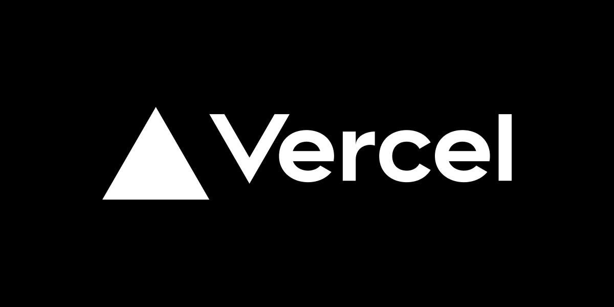

## NodeByte Discord Forums
A simple yet stunning site used to show index threads from our Discord Server in the web.

#### Proudly Hosted On

---

### Features
- Stunning yet minimalistic design
- PostgreSQL integration via Prisma
- Custom SVG generator for a "forum" channel playground

---

### Commands
- `[bun|yarn|npm] run dev`: run the website in a development environment (localhost)
- `[bun|yarn|npm] run build`: compile/build the website and populate its `.next` dir.
- `[bun|yarn|npm] start`: run the website in a production environment
- `[bun|yarn|npm] lint`: run eslint to help fix and formatting errors.

> We will generate a prisma client for you when you run `[bun|yarn|npm] install`

---
